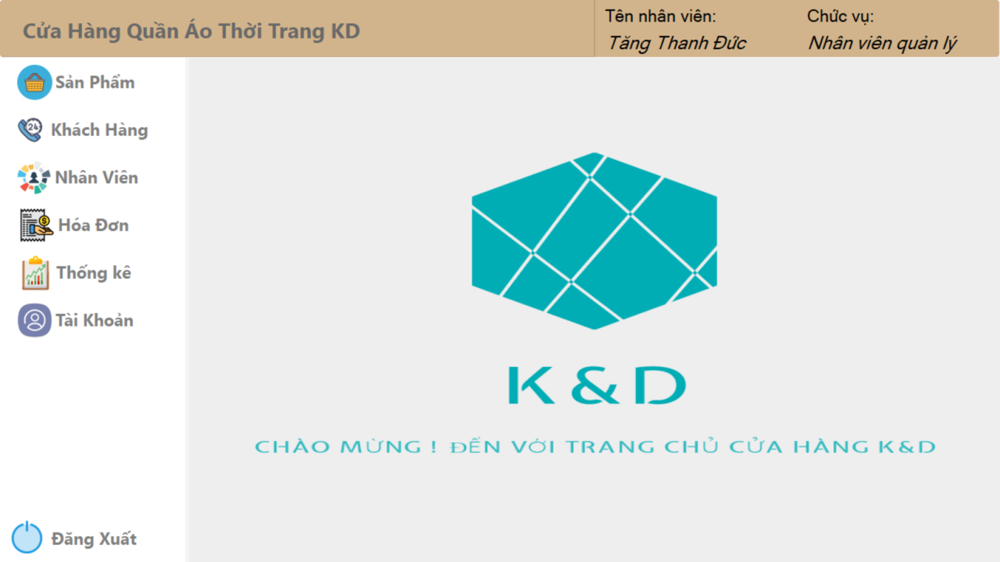
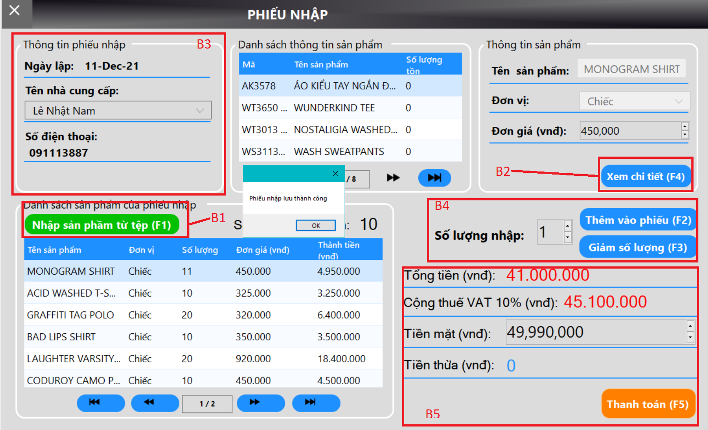
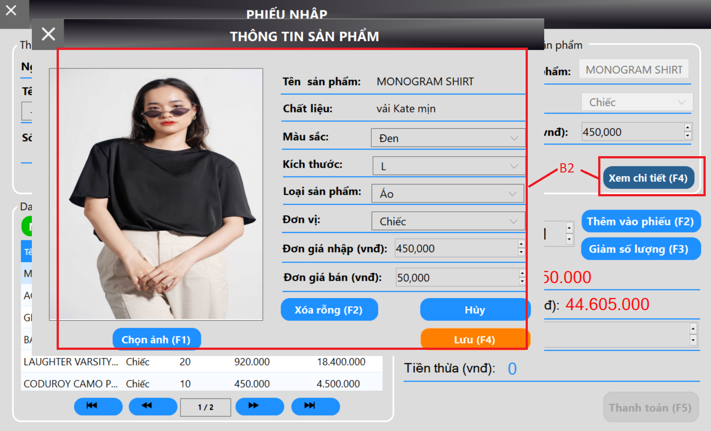
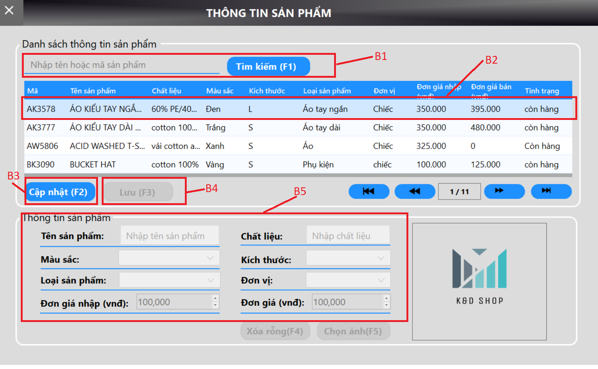
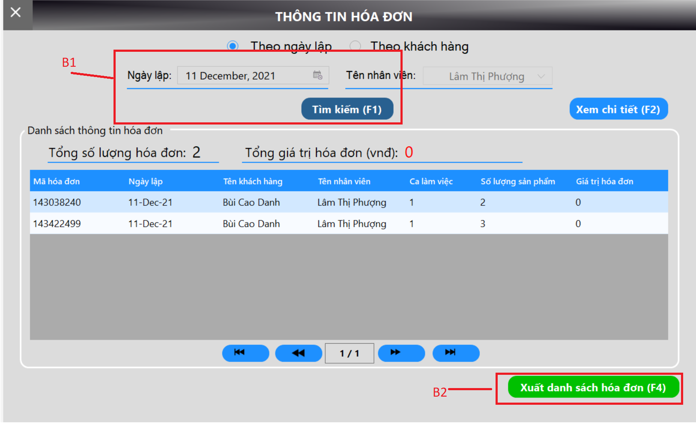
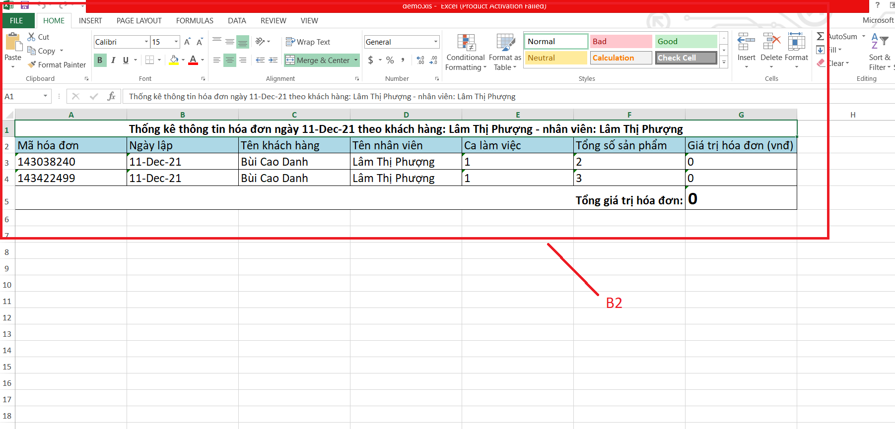
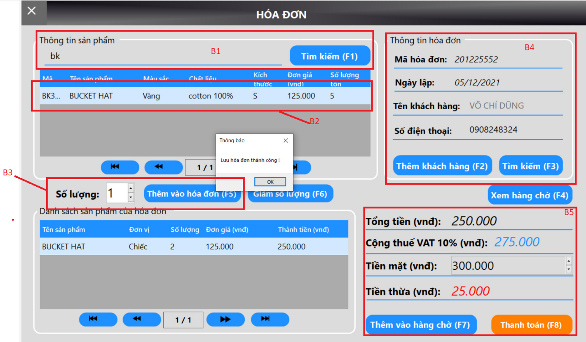

 <h1 align="center"> Fashion_store_management_application</h1>

# ⭐ Introduction

Here is my C# source code for  Fashion_store_management_application. with my code, you could: 
Main functions of the application:
* **Product management (Add, update, search)**
* **Invoice management (Add, update, search)**
* **Customer information management (Update)**
* **Employee information management (Add, update)**
* **Account information management (Add, update)**
* **Report and statistics management (Generate reports, sort data)**

# ⭐ Experiments

## 1. Login

 

## 2. Home

 
 
## 3. Import of Products

 

  

## 4. Products

 

 ## 5. Invoicing and Payment

 

 

  

 # ⭐ Future Features

-   Pending

_Feel free to fork and contribute to include these features._ ❤︎

# 🚀 Technologies

 Programming tools and languages used:
  -   Database management system: Microsoft SQL Server 2014.
  -   Programming tools: Visual Studio 2019 IDE cho C#/Visual Basic .NET
  -   Programming language: C#.

# 🤝 Contribute

To contribute, fork the repository and push the changes to the **master** branch. Then submit a pull request for merging with the source. If your code passes the review and checks it will be merged into the master branch.

# 💬 Feedback

Feel free to send us feedback on [gmail]. Feature requests are always welcome.

# 📝 License

Licensed under the [MIT License].
  
