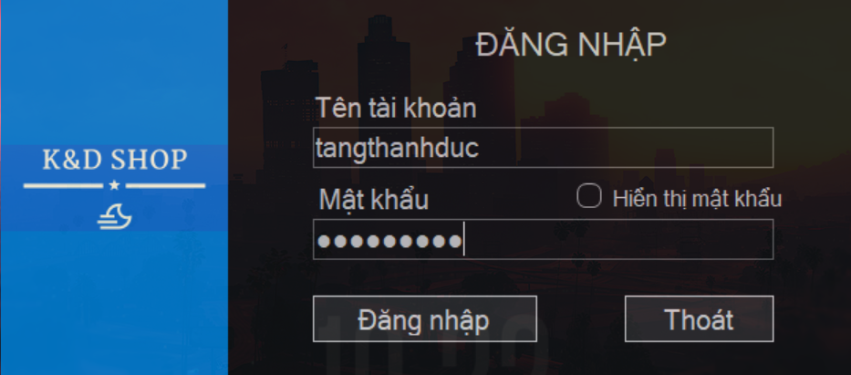

 <h1 align="center"> Fashion_store_management_application</h1>

# Introduction

Here is my C# source code for  Fashion_store_management_application. with my code, you could: 

## 1. Login

 

## 2. Home

 
 
## 3. Import of Products

 

  

## 4. Products

 

 ## 5. Invoicing and Payment

 

 

  

 # ⭐ Future Features

-   Pending

_Feel free to fork and contribute to include these features._ ❤︎

# 🚀 Technologies

 Programming tools and languages used:
  -   Database management system: MySQL.
  -   Programming tools: Spring Tool Suite 4, Visual Studio Code, Eclipse.
  -   Programming language: Java.
    
 Supported libraries and frameworks:
  -   Spring Boot, Spring Data JPA, Thymeleaf, Lombok, and some other libraries

# 🤝 Contribute

To contribute, fork the repository and push the changes to the **master** branch. Then submit a pull request for merging with the source. If your code passes the review and checks it will be merged into the master branch.

# 💬 Feedback

Feel free to send us feedback on [gmail]. Feature requests are always welcome.

# 📝 License

Licensed under the [MIT License].
  
